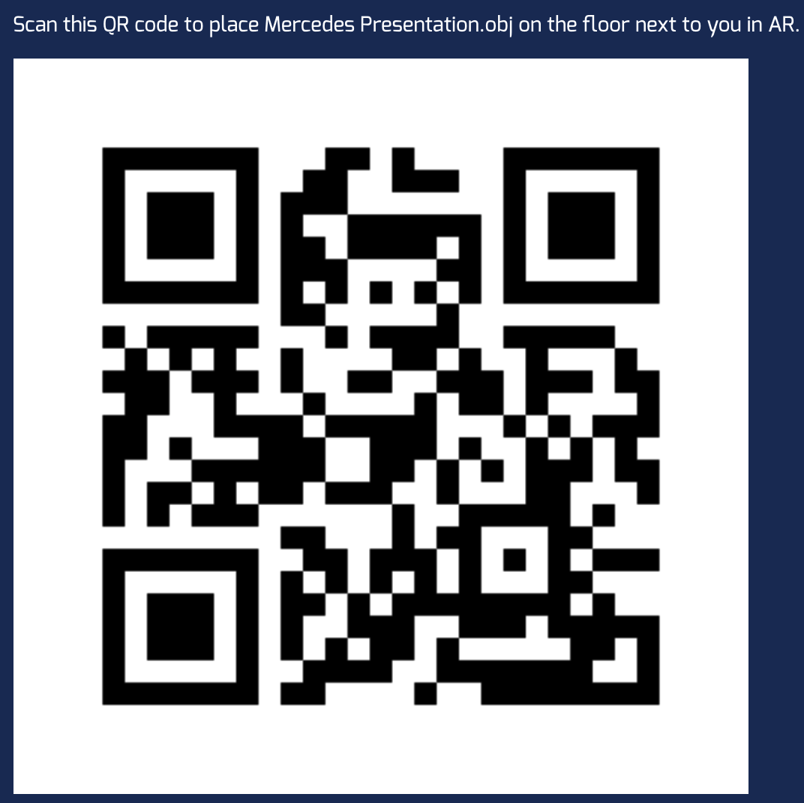

# SmartHack | Mercedez-Benz Case | MercedezXBoom Team
## Mercedes Awakening
Creating an APP using AR to give the customer an unique experience in the Mercedes-Benz Showroom.

### Key features:
* Customer View
    * Turn car “ON” (bring the car to life): turns headlight on and leds underneath the car, low engine noise from speaker
    * Creating Labels with different features of the car.
    * Inspect the anatomy of the car
* Administrator View
    * Change colours of the 3D models
    * Change the descriptions of the car
    * Enable/disable the panels from the showroom

### Use our QR code to see our 3D models to your phone.
Just scan the QR. You don't need to install any app.

### Technologies needed
* EchoAR
* 3D Modeling
* Swift (iOS specific)

### Short Prototype presentation
[Youtube Video](https://youtu.be/xlBglN1jdEA)

### App presentation
[Youtube Video](https://youtu.be/R4MvJOxty14)